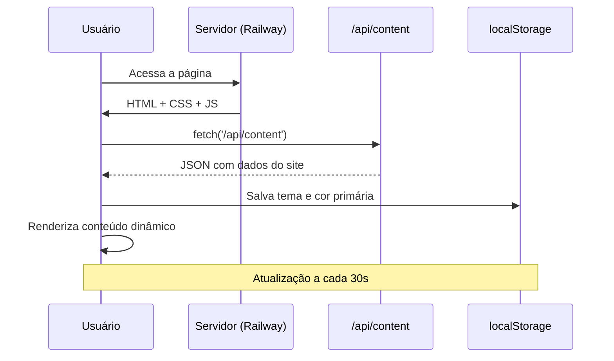

<p align="center">
  
</p>

<p align="center">
  
  
  
  
</p>

<br>

<h1 align="center">🚀 𝚈𝟸𝚔𝙳𝚎𝚟𝚆𝚘𝚛𝚔𝚜</h1>

<p align="center">
  Site institucional para apresentação de sistemas e automação para Discord.
</p>

<p align="center">
  <b>𝙼𝚊𝚍𝚎 𝙱𝚢 𝚈𝟸𝚔_𝙽𝚊𝚝</b>
</p>

---

## ✦ 𝙰𝙱𝙾𝚄𝚃

> O **Y2kDevWorks** é um site institucional desenvolvido com **HTML5, CSS3 e JavaScript puro**, projetado para apresentar sistemas profissionais de automação para Discord. Inclui loader premium, tema claro/escuro, animações e integração com API de conteúdo.

---

## ✦ 𝙵𝙴𝙰𝚃𝚄𝚁𝙴𝚂

```txt
🎨 DESIGN PREMIUM    → Loader animado, glassmorphism, gradientes e sombras
🌗 TEMA DINÂMICO     → Suporte a Dark/Light mode com CSS Variables
📱 RESPONSIVO        → Adaptável a todos os dispositivos (mobile, tablet, desktop)
⚡ PERFORMANCE       → CSS puro otimizado, JavaScript vanilla, sem frameworks
🔌 API INTEGRATION   → Conteúdo dinâmico via /api/content (JSON)
🧠 SEO               → Meta tags Open Graph, Twitter Card e dados estruturados
```

---

✦ 𝚂𝚈𝚂𝚃𝙴𝙼 𝙵𝙻𝙾𝚆



---

## ✦ 𝚂𝙴𝙲𝚃𝙸𝙾𝙽𝚂

| Seção | Descrição |
|--------|-----------|
| `Loader` | Animação de terminal com barra de progresso |
| `Navbar` | Menu fixo com efeito glass ao scrollar |
| `Hero` | Banner principal com stats animados e CTA |
| `Soluções` | Grid de cards dos sistemas desenvolvidos |
| `Sobre` | Perfil com skills, conquistas e experiência |
| `Contato` | Links para Discord e Email com horários |
| `Footer` | Navegação, links sociais e copyright |

---

## ✦ 𝚃𝙴𝙲𝙽𝙾𝙻𝙾𝙶𝙸𝙴𝚂

| Tecnologia | Uso |
|------------|-----|
| `HTML5` | Estrutura semântica |
| `CSS3` | Variáveis, animações, glassmorphism, responsivo |
| `JavaScript` | Fetch API, renderização dinâmica, animações |
| `Font Awesome` | Ícones vetoriais |
| `Google Fonts` | Inter, JetBrains Mono, Space Grotesk |
| `Railway` | Hospedagem do site e API |

---

## ✦ 𝙲𝙾𝙼𝙿𝙾𝙽𝙴𝙽𝚃𝚂

| Componente | Descrição |
|------------|-----------|
| `Loader Premium` | Animação de entrada com logo e shimmer |
| `Navbar Glass` | Efeito blur e transparência ao scrollar |
| `Hero Stats` | Contadores animados com IntersectionObserver |
| `Project Cards` | Cards com hover effects e borda gradiente |
| `Contact Methods` | Links estilizados com ícones e informações |
| `Theme Toggle` | Persistência via localStorage e API |

---

## ✦ 𝙳𝙸𝚁𝙴𝚃𝙾𝚁𝙸𝙴𝚂

| Arquivo / Pasta | Descrição |
|----------------|-----------|
| `index.html` | Estrutura completa do site |
| `/api/content` | Endpoint que retorna JSON com dados dinâmicos |
| `localStorage` | Armazena tema, cor primária e configurações |
| `assets/` | Imagens e recursos estáticos |

---

## ✦ 𝙾𝙱𝙹𝙴𝙲𝚃𝙸𝚅𝙴

| Objetivo |
|----------|
| ✔ Apresentar sistemas profissionais para Discord |
| ✔ Facilitar o contato para orçamentos |
| ✔ Demonstrar experiência e portfólio |
| ✔ Oferecer design moderno e responsivo |

---

📌 Status

🟢 Online • ⚡ Estável • 🔒 Seguro

---

<p align="center">
  <b>© 2026 Y2kDevWorks • 𝙼𝚊𝚍𝚎 𝙱𝚢 𝚈𝟸𝚔_𝙽𝚊𝚝</b>
</p>